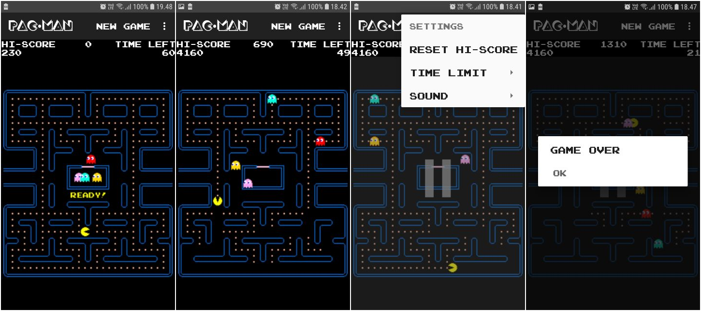

# Pacman
Simplified Pac-Man clone with original game board and characters.

Mandatory Assignment in Android - PBA in Software Development, Autumn 2018 - Business Academy Aarhus

## Sounds
All sounds are modified/unmodified copies from https://github.com/masonicGIT/pacman/tree/master/sounds

## Graphics
The game board is a modified version of http://pacman.wikia.com/wiki/Pac-Man_Maze?file=Originalpacmaze.png.

All other images are custom-made imitations of the originals.

## Fonts
The game uses the fonts Emulogic and Crack-Man taken from www.classicgaming.cc

## Screenshots

## Licence
This program is free software: you can redistribute it and/or modify it under the terms of the GNU General Public License Version 3 as published by the Free Software Foundation.
